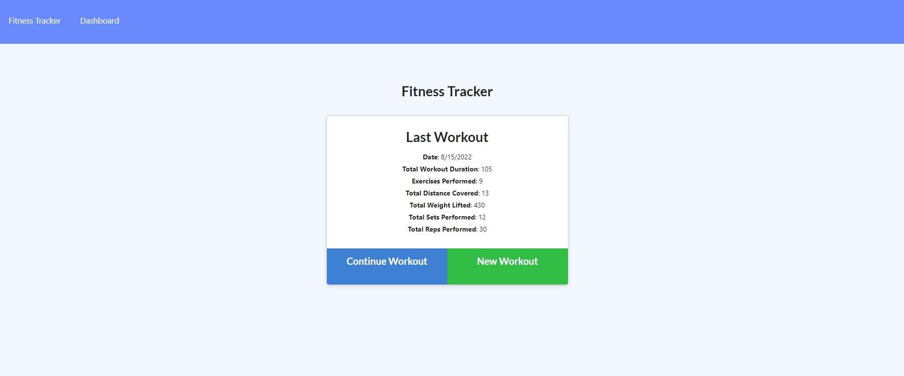
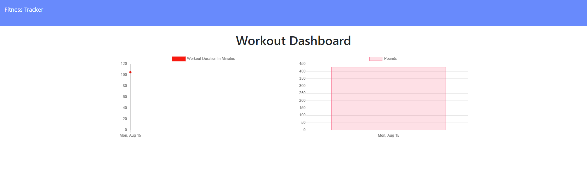

# Track-My-Budget

Track-My-Fitness is a fitness tracking application that connects to a MongoDB database, so provided you have an internet connection you can track your workouts from anywhere. You can track the name, type, weight, sets, reps, and duration of your exercises. you can then track your routine/progress on the Dashboard using the very easy to read charts generated within the system.

## Demo

---

https://uwa-track-my-fitness.herokuapp.com/?id=62f9dd2654e1154a3421214c

## Questions

---

For any questions and support please contact Tristan Fontanini.

- Email: mousy93@hotmail.com
- Github: [Tristan Fontanini](https://github.com/Twistedmouse)
